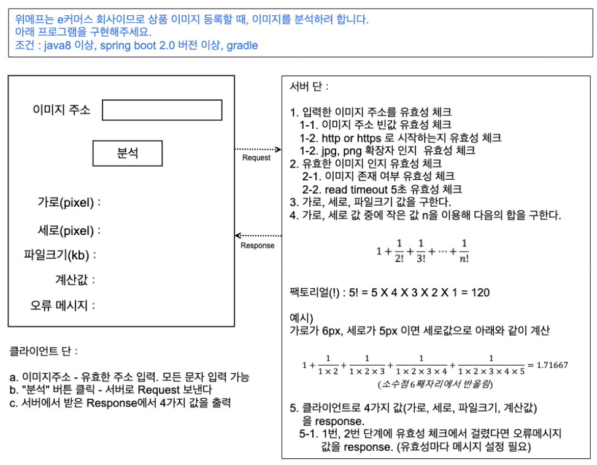
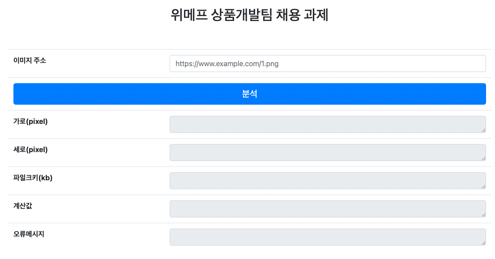

## 채용과제 구현 검증용 repository
* 실제로 활용되지 않은 과제

## 과제 문제
<p align="center"></p>

[pdf 다운로드](./file/상품개발팀_채용_과제.pdf)

## 실행방법
1. spring-boot run
2. 브라우저 접속 "http://localhost:8080"

## 개발 프레임워크 및 라이브러리

* Java 8
* Spring Boot 2.7.6
* Gradle
* Lombok
* Thymeleaf

## 프론트
   <p align="center"></p>

## 백엔드

### 패키지 구조
-  도메인 주도 설계 레이어 구성 참고

```yaml
├─main
│  ├─java
│  │  └─com
│  │      └─wmp
│  │          └─assignment
│  │              ├─common
│  │              │  ├─exception
│  │              │  │  ├─badrequest
│  │              │  │  ├─handler
│  │              │  │  ├─system
│  │              │  │  └─util
│  │              │  └─util
│  │              └─presentation
│  │                 └─api
│  │                   ├─controller
│  │                   ├─dto
│  │                   │  └─response
│  │                   └─service
│  └─resources
│      ├─static
│      │  └─js
│      └─templates
└─test
```

#### presentation 영역
- api
  - controller
    - 데이터 요청을 받는 Presentation 영역
    - 엔드포인트
  - service
    - 비즈니스 로직 수행
    - 트랜잭션 단위 처리
  - dto
    - 데이터를 전달하는 객체